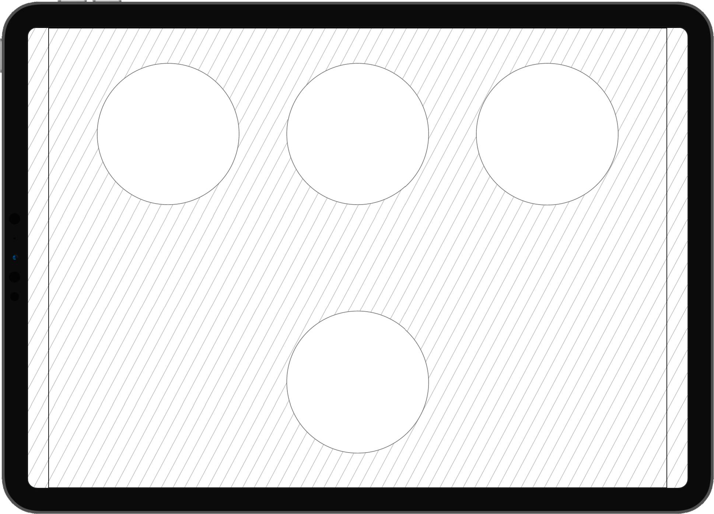

## Drag & Drop головоломка

Рекомендуемая версия Unity: 2019.2.21f1
 Целевые платформы: смартфоны и планшеты на ОС iOS & Android

### Геймплей
Основной механикой игры является нахождение соответствий. 
На игровом поле располагаются три "слота" и один предмет, совпадающий по силуэту с одним из "слотов".

Игровой цикл начинается вступлением, когда 3 "слота" анимированно появляются на экране и анимированным появлением случайного (одного из трех) предмета.

Задачей игрока является перетащить появившийся предмет в подходящий (совпадающий с ним по силуэту) "слот".
 - После того как игрок справляется с задачей, появляется новый предмет
 - Когда незанятых слотов не остается, игра заканчивается
  
 - Если игрок отпустил предмет слишком далеко от "слота" или же переместил его в неподходящий слот, предмет анимированно возвращается на свою начальную позицию
 - Если игрок переместил предмет в подходящий "слот", предмет занимает место "слота", а на начальной позиции анимированно появляется новый предмет, если не выполнено условие завершения игры
 
Для справки по верстке можно обращаться к схематичному изображению (см. ниже)

### Анимации и звуки

#### Анимации

 - "Слоты" анимированно появляются из-за верхней границы экрана и занимают свои места в соответствии со схемой (см. ниже)
 - "Слоты" появляются не одновременно, а один за другим, с небольшой задержкой
  
 - Интерактивный предмет появляется из-за правой границы экрана и занимает свое место в соотв. со схемой

_Для всех анимаций появления необходимо использовать любую нелинейную анимацию перемещения_

#### Звуки 
 - Появление слотов и интерактивных предметов должно сопровождаться звуковым эффектом (item_appear.mp3)
 - Успешная установка предмета в слот должна сопровождаться звуковым эффектом (item_success.mp3)
 
### Игровая область
Игровая область - это область экрана, в границах которой отрисовываются интерактивные элементы игры.
Игровая область должна помещаться в экран пользователя с выравниванием по высоте и центрированием по горизонтали.
_Пропорции игровой области: 4:3_

### Фон
В качестве фона следует использовать заливку "плиткой" (tile.png). Необходимо убедиться, что фон покрывает достаточную площадь и установлен в такую позицию, чтобы на любых мобильных устройствах не возникало "пустых" областей

### Схематичное изображение

Три верхних окружности представляют места для "слотов", нижняя - место интерактивного предмета

Вертикальные полосы по у краев экрана представляют границы игровой области. Границы игровой области представлены на схеме для удобства и не должны графически отображаться в игре

#### Примечание
Требования к фону, а также размерам, пропорциям и позиции игровой области составлены таким образом для того, чтобы обеспечить отсутствие "черных полос" на устройствах с самыми разными пропорциями экрана
